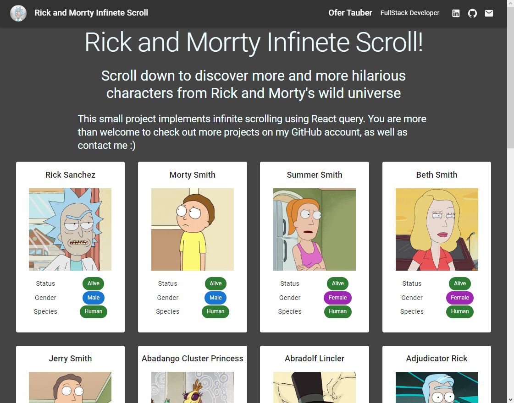

# **Rick and Morty infinite scrolling app**

# Abute

This is a small and fun React application that I built in order to learn and implement the use of React-query, and actually also MaterialUI.

The app displays a gallery of characters from the "Rick and Morty" universe, including a photo and basic information. As you scroll down the screen, more and more characters are loaded so that an "infinite scrolling" effect is created. There are about 800 figures in total (about 40 additional "pages" beyond the initial display).

## Data resource

The app if fetching data from [Rick and Morty API](https://rickandmortyapi.com).

# Technologies


This is a `React`-based application (written in `TypeScript`), where all components are based on `MaterialUI`.

I created a ref to the viewpoint using `react-intersection-observer` library, and every time the user scrolls down and reaches it - this is the trigger for pulling new information.

The app's only state handels the data fetched from the API and is entirely managed by `React-query`.

# Status and continued development

- Currently - in case of a loading error the application simply returns a component with the word "error". You are more than welcome to switch to the "Development" branch and check the progress in handling failures.
  **If you have any suggestions on the subject - I'd love to hear them!**

- The styling of the MUI components is performed almost entirely using the sx attributes. Right now I'm working on changing that.

# Install and run

### `Prerequisites:`

- Node V 16.15 or higher

### `Installation and running:`

```bash
npm install

# To start the app in whtch mode on localhost:
npm start
```

# Let's get in touch!

You are very welcome to contact me about the project - suggestions, questions, tips,
requests, and of course - information about job offers.

- My mail: [ofertauber@gmail.com](mailto:ofertauber@gmail.com)
- My LinkedIn profile [https://www.linkedin.com/in/ofertauber/](https://www.linkedin.com/in/ofertauber/)

# Deno

### [Link](https://infinete-scroll.netlify.app)


